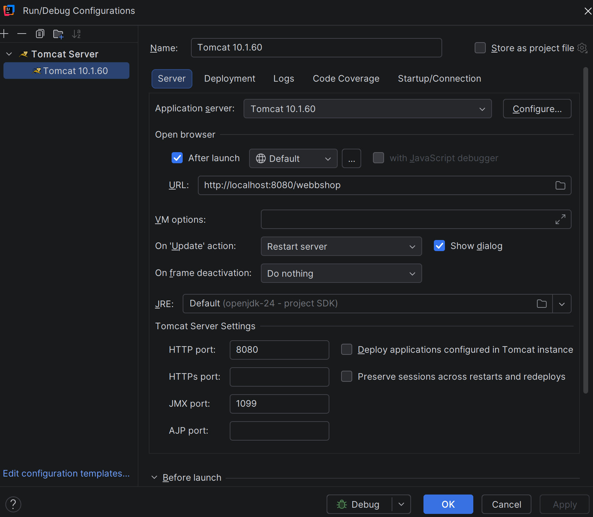
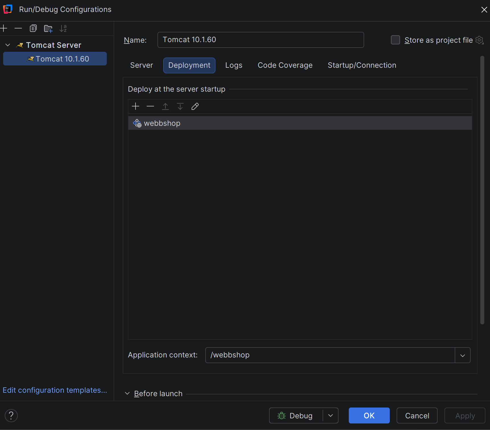

To run one needs to install the following prerequisites:
PostgreSQL, Apache Tomcat, IntelliJ Ultimate (for this guide)

Create a database and apply the credentials in ShopDB.java.

Create the tables using Schema.sql, found in: src/main/resources.

At the very least insert the users from TestRows.sql, also
found in src/main/resources.

Add a new Run Configuration with Tomcat Server, local.
Add the build artifact under deployment and it should run.

Note: build artifact is named "HI1031-LAB1:war exploded", rename it to webbshop if you want (we did so). 

If you do all the above it should look so:

